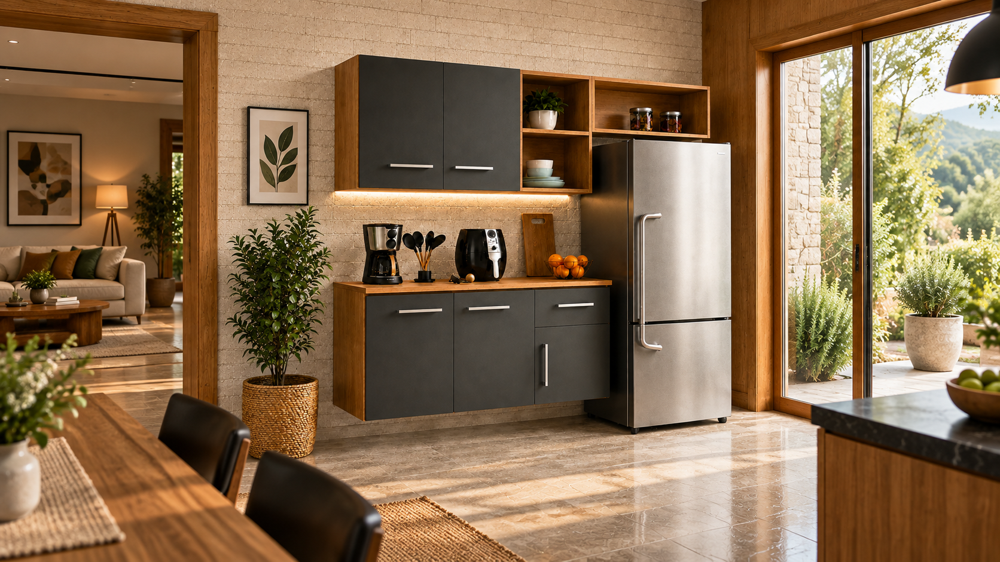

<div align="center">

  

  <h1>Blue Moby</h1>

  <p><strong>Sua casa. Seu mundo. Seu jeito.</strong></p>
  <p>Design para a vida real — uma experiência digital para descobrir móveis,<br>explorar ambientes e conhecer quem está por trás de cada escolha.</p>

  <p>
    
    
    
    
  </p>

  <p>
    <a href="#a-experiência">Experiência</a> ·
    <a href="#executar-localmente">Como executar</a> ·
    <a href="#estrutura-do-projeto">Estrutura</a> ·
    <a href="#a-blue-moby">Sobre a empresa</a>
  </p>

</div>



## Um espaço para descobrir o próximo ambiente

Site institucional e vitrine de produtos da **Blue Moby**, desenvolvido com HTML, CSS e JavaScript. A proposta combina fotografia de ambientes, tipografia editorial e interações discretas para apresentar a marca com clareza e personalidade.

A coleção pode ser explorada por ambiente, com detalhes de cada peça e acesso direto aos anúncios disponíveis no Mercado Livre e na Shopee. A compra continua na plataforma escolhida pelo visitante.

## A experiência

| Recurso | O que o visitante encontra |
| --- | --- |
| **Abertura imersiva** | Carrossel de quatro ambientes, com transição suave a cada 6 segundos e avanço manual à direita, integrado ao título por uma camada de cor translúcida. |
| **Coleção por ambiente** | Filtros para cozinha, quarto, sala de estar, banheiro e jantar. |
| **Detalhes de cada peça** | Pop-ups com imagem, descrição, cópia do nome e links específicos dos anúncios. |
| **Marketplaces** | Abas para Mercado Livre e Shopee; cada produto mostra apenas as plataformas em que está disponível. |
| **Claro e escuro** | Alternância entre superfícies claras e variações do azul da marca. |
| **Três idiomas** | Português, inglês e chinês simplificado, incluindo descrições e controles da interface. |
| **Preferências salvas** | Tema e idioma mantidos no navegador por meio de `localStorage`. |
| **Movimento sutil** | Letreiro contínuo com pausa, menu mobile animado e respostas ao passar o mouse. |
| **Proximidade com a marca** | Apresentação da empresa, registros reais da operação e acesso ao SAC pelo WhatsApp. |

### Identidade visual

O azul **`#002F6D`** conduz a identidade, acompanhado por fundos claros, espaço entre os elementos e fotografias em destaque. **DM Sans** e **Manrope** dão clareza aos textos; **Cormorant Garamond** acrescenta o detalhe cursivo aos títulos e nomes dos modelos.

O layout se adapta a computadores e celulares. A interface inclui navegação por teclado nas abas, estados de foco, textos alternativos nas imagens e respeito à preferência de movimento reduzido.

## Executar localmente

O projeto é estático: **não precisa de instalação de pacotes nem de etapa de build**. Para a prévia abaixo, tenha o Git e o Python 3 instalados.

```sh
git clone https://github.com/Matheus-Coltro/bluemoby-page.git
cd bluemoby-page
python -m http.server 4173
```

Abra **[localhost:4173/](http://localhost:4173/)** no navegador.

> No Windows, se o comando `python` não estiver disponível, use `py -m http.server 4173`. Também é possível servir a pasta raiz com o Live Server do VS Code e abrir `index.html`.

As fontes são carregadas pelo Google Fonts; sem conexão, o navegador utiliza as fontes alternativas definidas no CSS.

## Estrutura do projeto

```text
bluemoby-page/
├── index.html              # Página inicial e conteúdo das seções
├── styles/
│   └── main.css            # Identidade visual, temas e responsividade
├── scripts/
│   ├── app.js              # Coleção, filtros, pop-ups, menu e abas
│   ├── hero-carousel.js    # Carrossel da abertura e temporização
│   └── preferences.js      # Traduções e preferências do visitante
├── images/
│   ├── brand/              # Logo e mascote
│   ├── hero/               # Imagem de abertura
│   ├── rooms/              # Ambientes da casa
│   ├── products/           # Fotografias dos produtos
│   ├── company/            # Estrutura e rotina da empresa
│   ├── marketplaces/       # Marcas das plataformas de venda
│   └── archive/            # Imagens preservadas, fora da página atual
├── docs/
│   └── marketplace-logos.txt # Origem das marcas dos marketplaces
├── .gitignore
└── README.md
```

### Atualizar a vitrine

- **Produtos e anúncios:** edite `products` e `listings` em [`scripts/app.js`](scripts/app.js). Cadastre somente os links das plataformas em que cada produto é vendido.
- **Textos e seções:** edite [`index.html`](index.html). Ao alterar um texto em português, atualize também a entrada correspondente no dicionário de [`scripts/preferences.js`](scripts/preferences.js).
- **Cores e apresentação:** ajuste [`styles/main.css`](styles/main.css), verificando os dois temas e as larguras de tela.
- **Imagens:** adicione os arquivos na categoria correspondente de [`images/`](images/) e atualize suas referências e descrições alternativas.

Os nomes usados como chaves em `listings` devem corresponder aos nomes em `products`. As categorias internas permanecem em português; a tradução altera sua apresentação ao visitante.

Para publicar em uma hospedagem estática, publique a raiz do repositório, mantendo `styles/`, `scripts/` e `images/` ao lado de **`index.html`**. A página abre diretamente na URL principal, inclusive em um subdiretório como o de um projeto no GitHub Pages.

## SEO e presença no Google

O projeto inclui sitemap, robots.txt, URL canônica, dados estruturados da empresa e coleção no HTML inicial. Veja o [guia de SEO e indexação](docs/seo.md) para publicar, verificar o domínio no Google Search Console e enviar o sitemap.

Ao atualizar a coleção, execute o comando abaixo antes de publicar:

    node tools/update-catalog.cjs

## A Blue Moby

Com sede em **Fernandópolis, São Paulo, Brasil**, a Blue Moby atua em **fabricação, varejo e importação**. Presente no comércio online desde **2025**, a empresa está em constante crescimento, conectando sua estrutura física aos canais digitais e ao atendimento próximo dos clientes.

<div align="center">

  <a href="https://mercadolivre.com.br/pagina/bluemoby2">Mercado Livre</a> &nbsp;·&nbsp;
  <a href="https://shopee.com.br/bluemoby">Shopee</a> &nbsp;·&nbsp;
  <a href="https://wa.me/5517981179074">Atendimento pelo WhatsApp</a>

  <br><br>

  <sub>Blue Moby · CNPJ 40.831.990/0001-24</sub><br>
  <sub>Design e praticidade para o seu dia a dia.</sub>

</div>
